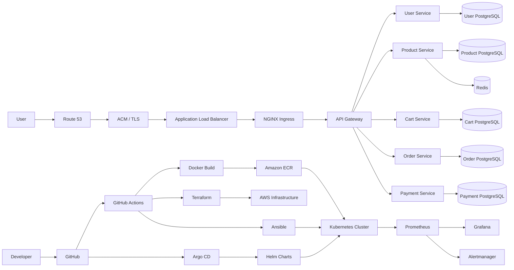

## 🏗️ Platform Architecture

  

  
    End-to-end cloud-native platform architecture covering AWS infrastructure,
    Kubernetes, Terraform, Ansible, CI/CD, GitOps, security, and observability.
  

<b>View request and deployment flows</b>

 

